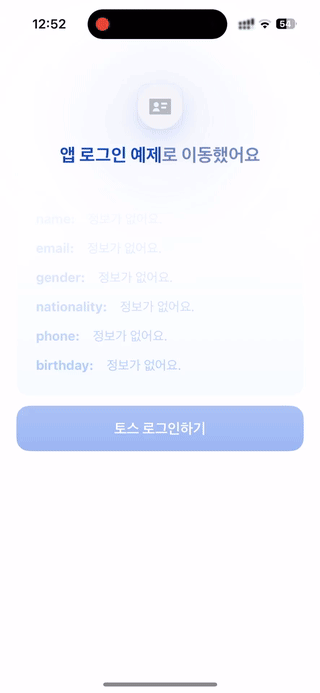

# App Login Example


`appLogin`을 사용해 인가 코드(`authorizationCode`)와 `referrer`를 받아  
서버에 전달한 뒤 로그인, 토큰 재발급, 로그아웃(accessToken, userKey)을 테스트할 수 있는 예제예요.



<br />

## 📝 사전 준비

1. 앱인토스 콘솔 > 개발에서 토스 로그인을 추가해 주세요.  
   이 과정에서 권한, 연결 끊기 콜백 정보, 약관 등을 함께 설정할 수 있어요.

2. 토스 로그인을 추가한 후, 복호화 키 발급을 신청해 주세요.  
   신청이 완료되면, 등록된 이메일로 복호화 키와 AAD가 전달돼요.

3. 앱인토스 콘솔 > 개발에서 mTLS 인증서도 함께 발급받아 주세요.

<br />

## 🚀 설치 및 실행 방법

1. **ZIP 파일**을 다운로드하고 압축을 풀어주세요.

2. 로컬 서버를 세팅해요.  
   2-1. 로컬 서버 경로로 이동 후 필요한 패키지를 설치해요.

   ```
   cd server
   yarn install
   ```

   2-2. `server/.env.server`에서 환경 변수를 입력해 주세요.

   ```bash
   # CLIENT_CERT_PATH / CLIENT_KEY_PATH
   # 발급받은 mTLS 인증서를 server/cert 폴더에 넣고 경로를 지정해 주세요.
   CLIENT_CERT_PATH=cert/public.crt
   CLIENT_KEY_PATH=cert/private.key

   # AAD_STRING / DECRYPTION_KEY_BASE64
   # 발급받은 AAD를 입력해주세요.
   # 발급받은 복호화 키를 입력해주세요.
   AAD_STRING=AAD
   DECRYPTION_KEY_BASE64=복호화키
   ```

   2-3. 로컬 서버를 실행해요.

   ```
   yarn dev
   ```

3. 예제 앱을 세팅해요.  
    3-1. `app/.yarnrc.yml` 파일의 `npmAuthToken` 항목에, [toss-design-system 그룹](https://tossmini-docs.toss.im/tds-react-native/setup-npm/)에 초대된 npm 계정의 토큰 값을 입력해주세요.

   3-2. 예제 앱 경로로 이동 후 필요한 패키지를 설치해요.

   ```
   cd app
   yarn install
   ```

   3-3. `app/bedrock.config.ts` 파일 안에 있는 [env](https://developers-apps-in-toss.toss.im/bedrock/release-notes/2025-05-15.html#react-native-bedrock-plugin-env-%E1%84%91%E1%85%B3%E1%86%AF%E1%84%85%E1%85%A5%E1%84%80%E1%85%B3%E1%84%8B%E1%85%B5%E1%86%AB-%E1%84%8E%E1%85%AE%E1%84%80%E1%85%A1) 설정에 로컬 서버 주소를 입력해 주세요.

   ```ts
   import { env } from '@react-native-bedrock/plugin-env';

   export default defineConfig({
     appName: 'with-app-login',
     plugins: [
       // ...
       env({
         // 로컬 서버 주소를 입력해 주세요.
         SERVER_BASE_URL: 'http://localhost:4000',
       }),
     ],
   });
   ```

   3-4. 예제 앱을 실행해요.

   ```
   yarn dev
   ```

4. 샌드박스 앱을 실행한 뒤, [개발자 로그인](https://developers-apps-in-toss.toss.im/prepare/sandbox.html#%E1%84%80%E1%85%A2%E1%84%87%E1%85%A1%E1%86%AF%E1%84%8C%E1%85%A1-%E1%84%85%E1%85%A9%E1%84%80%E1%85%B3%E1%84%8B%E1%85%B5%E1%86%AB%E1%84%92%E1%85%A1%E1%84%80%E1%85%B5)을 하고 예제를 테스트해 보세요.

<br />

## 📌 참고사항

- [appLogin](https://developers-apps-in-toss.toss.im/bedrock/reference/framework/%EB%A1%9C%EA%B7%B8%EC%9D%B8/appLogin.html)
- [개발자 로그인하기](https://developers-apps-in-toss.toss.im/prepare/sandbox.html#%E1%84%80%E1%85%A2%E1%84%87%E1%85%A1%E1%86%AF%E1%84%8C%E1%85%A1-%E1%84%85%E1%85%A9%E1%84%80%E1%85%B3%E1%84%8B%E1%85%B5%E1%86%AB%E1%84%92%E1%85%A1%E1%84%80%E1%85%B5)
