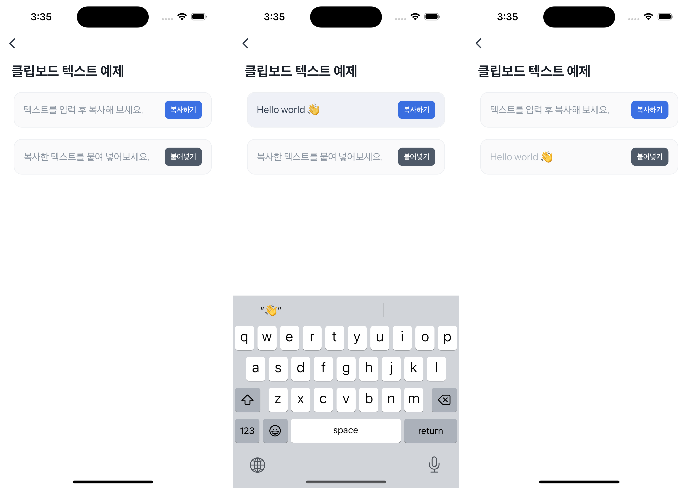

# Clipboard Text Example


`getClipboardText`와 `setClipboardText`를 사용하여 텍스트를 복사하고 붙여넣는 예제예요.

클립보드는 [**권한 설정**](https://developers-apps-in-toss.toss.im/bedrock/reference/framework/%EA%B6%8C%ED%95%9C/permission.html)이 필요해요. 이 설정은 `granite.config.ts`에 작성하고, 설정이 끝난 뒤에는 `getPermission`으로 현재 권한 상태를 확인하고 `openPermissionDialog`로 권한 다이얼로그를 사용자에게 보여줄 수 있어요.



<br />

## 📲 체험하기

&nbsp;

<br />

## 🚀 설치 및 실행 방법

1. **ZIP 파일**을 다운로드하고 압축을 풀어주세요.

2. `.yarnrc.yml` 파일의 `npmAuthToken` 항목에, [toss-design-system 그룹](https://tossmini-docs.toss.im/tds-react-native/setup-npm/)에 초대된 npm 계정의 토큰 값을 입력해주세요.

3. 필요한 패키지를 설치해요.

   ```
   yarn install
   ```

4. 개발 서버를 실행해요.

   ```
   yarn dev
   ```

<br />

## 📌 참고사항

- [getClipboardText](https://developers-apps-in-toss.toss.im/bedrock/reference/framework/%ED%81%B4%EB%A6%BD%EB%B3%B4%EB%93%9C/getClipboardText.html)
- [setClipboardText](https://developers-apps-in-toss.toss.im/bedrock/reference/framework/%ED%81%B4%EB%A6%BD%EB%B3%B4%EB%93%9C/setClipboardText.html)
- [권한 설정하기](https://developers-apps-in-toss.toss.im/bedrock/reference/framework/%EA%B6%8C%ED%95%9C/permission.html)
