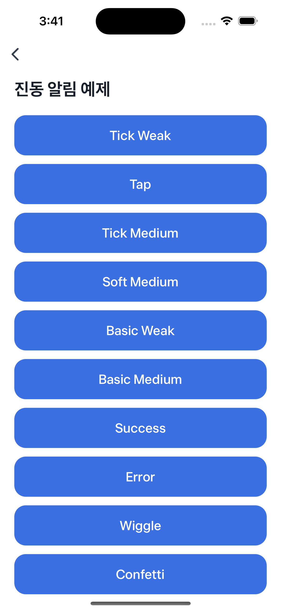

# Haptic Feedback Example


`generateHapticFeedback`을 사용한 진동 알림을 직접 테스트할 수 있는 예제예요.  
자세한 옵션은 [HapticFeedbackOptions](https://developers-apps-in-toss.toss.im/bedrock/reference/react-native-bedrock/%EC%9D%B8%ED%84%B0%EB%A0%89%EC%85%98/HapticFeedbackOptions.html)를 참고해 주세요.  
⚠️ 진동 기능은 실제 기기에서만 사용할 수 있어요.



<br />

## 📲 체험하기

&nbsp;

<br />

## 🚀 설치 및 실행 방법

1. **ZIP 파일**을 다운로드하고 압축을 풀어주세요.

2. `.yarnrc.yml` 파일의 `npmAuthToken` 항목에, [toss-design-system 그룹](https://tossmini-docs.toss.im/tds-react-native/setup-npm/)에 초대된 npm 계정의 토큰 값을 입력해주세요.

3. 필요한 패키지를 설치해요.

   ```
   yarn install
   ```

4. 개발 서버를 실행해요.

   ```
   yarn dev
   ```

<br />

## 📌 참고사항

- [generateHapticFeedback](https://developers-apps-in-toss.toss.im/bedrock/reference/react-native-bedrock/%EC%9D%B8%ED%84%B0%EB%A0%89%EC%85%98/generateHapticFeedback.html)
- [HapticFeedbackOptions](https://developers-apps-in-toss.toss.im/bedrock/reference/react-native-bedrock/%EC%9D%B8%ED%84%B0%EB%A0%89%EC%85%98/HapticFeedbackOptions.html)
