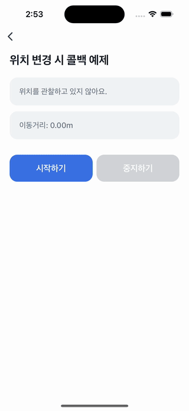

# Location Callback Example


`startUpdateLocation`을 사용해 현재 위치를 등록하고, 이동 거리를 계산해 물건을 잃어버리지 않게 안내하는 예제예요.

위치 정보는 [**권한 설정**](https://developers-apps-in-toss.toss.im/bedrock/reference/framework/%EA%B6%8C%ED%95%9C/permission.html)이 필요해요. 이 설정은 `granite.config.ts`에 작성하고, 설정이 끝난 뒤에는 `getPermission`으로 현재 권한 상태를 확인하고 `openPermissionDialog`로 권한 다이얼로그를 사용자에게 보여줄 수 있어요.

⚠️ 실내에서 테스트 시 GPS 정보가 부정확해요. 실내에서는 시뮬레이터나 에뮬레이터를 이용해 가상의 위치 정보를 받아 테스트를할 수 있어요.

- [iOS Simulator에서 위치 테스트](https://developer.apple.com/documentation/xcode/testing-complex-hardware-device-scenarios-in-simulator#Test-changing-locations)
- [Android Emulator에서 위치 테스트](https://developer.android.com/studio/run/emulator-extended-controls?hl=ko#:~:text=%EC%B6%94%EA%B0%80%EB%A5%BC%20%EC%B0%B8%EA%B3%A0%ED%95%98%EC%84%B8%EC%9A%94.-,%EC%9C%84%EC%B9%98,-%EC%97%90%EB%AE%AC%EB%A0%88%EC%9D%B4%ED%84%B0%EB%A5%BC%20%EC%82%AC%EC%9A%A9%ED%95%98%EB%A9%B4%20%EC%97%90%EB%AE%AC%EB%A0%88%EC%9D%B4%EC%85%98%EB%90%9C)



<br />

## 📲 체험하기

&nbsp;

<br />

## 🚀 설치 및 실행 방법

1. **ZIP 파일**을 다운로드하고 압축을 풀어주세요.

2. `.yarnrc.yml` 파일의 `npmAuthToken` 항목에, [toss-design-system 그룹](https://tossmini-docs.toss.im/tds-react-native/setup-npm/)에 초대된 npm 계정의 토큰 값을 입력해주세요.

3. 필요한 패키지를 설치해요.

   ```
   yarn install
   ```

4. 개발 서버를 실행해요.

   ```
   yarn dev
   ```

<br />

## 📌 참고사항

- [startUpdateLocation](https://developers-apps-in-toss.toss.im/bedrock/reference/framework/%EC%9C%84%EC%B9%98%20%EC%A0%95%EB%B3%B4/startUpdateLocation.html)
- [Accuracy](https://developers-apps-in-toss.toss.im/bedrock/reference/framework/%EC%9C%84%EC%B9%98%20%EC%A0%95%EB%B3%B4/Accuracy.html)
- [Location](https://developers-apps-in-toss.toss.im/bedrock/reference/framework/%EC%9C%84%EC%B9%98%20%EC%A0%95%EB%B3%B4/Location.html)
- [LocationCoords](https://developers-apps-in-toss.toss.im/bedrock/reference/framework/%EC%9C%84%EC%B9%98%20%EC%A0%95%EB%B3%B4/LocationCoords.html)
- [권한 설정하기](https://developers-apps-in-toss.toss.im/bedrock/reference/framework/%EA%B6%8C%ED%95%9C/permission.html)
