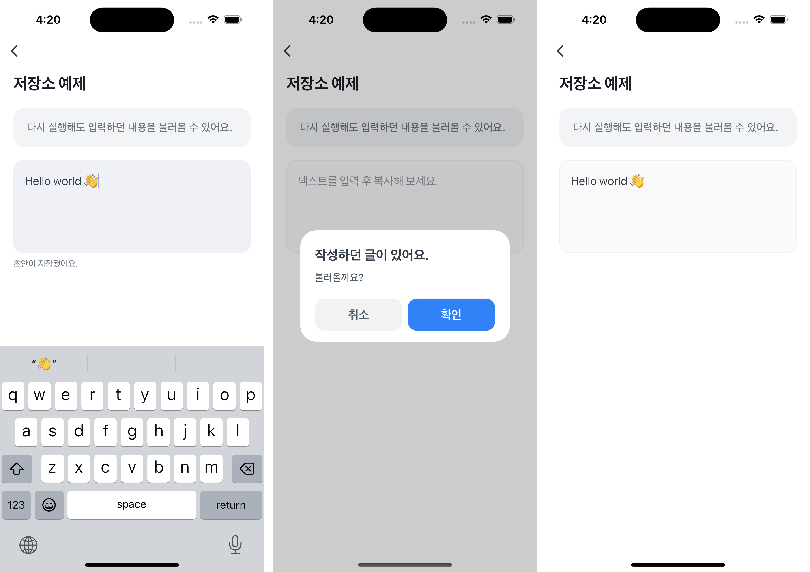

# Storage Example


`Storage`를 사용해 입력한 텍스트의 초안을 자동으로 저장하고, 앱을 다시 실행해도 이전에 작성하던 내용을 불러올 수 있는 예제에요.  
모바일 앱의 로컬 저장소를 활용하면 사용자의 데이터를 영구적으로 유지할 수 있어요.



<br />

## 📲 체험하기

&nbsp;

<br />

## 🚀 설치 및 실행 방법

1. **ZIP 파일**을 다운로드하고 압축을 풀어주세요.

2. `.yarnrc.yml` 파일의 `npmAuthToken` 항목에, [toss-design-system 그룹](https://tossmini-docs.toss.im/tds-react-native/setup-npm/)에 초대된 npm 계정의 토큰 값을 입력해주세요.

3. 필요한 패키지를 설치해요.

   ```
   yarn install
   ```

4. 개발 서버를 실행해요.

   ```
   yarn dev
   ```

<br />

## 📌 참고사항

- [Storage](https://developers-apps-in-toss.toss.im/bedrock/reference/framework/%EC%A0%80%EC%9E%A5%EC%86%8C/Storage.html)
- [clearItems](https://developers-apps-in-toss.toss.im/bedrock/reference/framework/%EC%A0%80%EC%9E%A5%EC%86%8C/clearItems.html)
- [getItem](https://developers-apps-in-toss.toss.im/bedrock/reference/framework/%EC%A0%80%EC%9E%A5%EC%86%8C/getItem.html)
- [removeItem](https://developers-apps-in-toss.toss.im/bedrock/reference/framework/%EC%A0%80%EC%9E%A5%EC%86%8C/removeItem.html)
- [setItem](https://developers-apps-in-toss.toss.im/bedrock/reference/framework/%EC%A0%80%EC%9E%A5%EC%86%8C/setItem.html)
